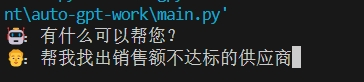
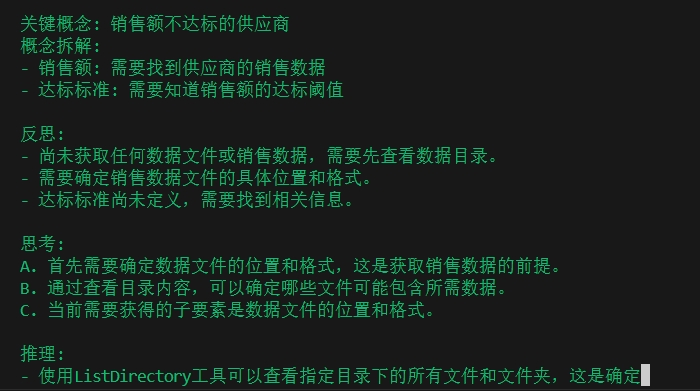
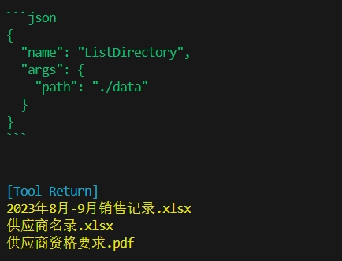
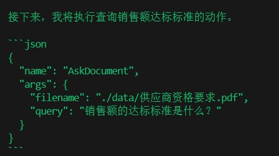
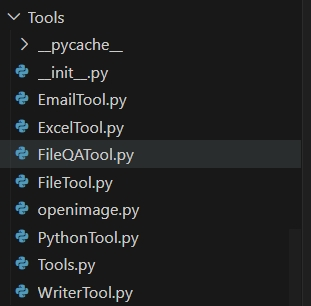
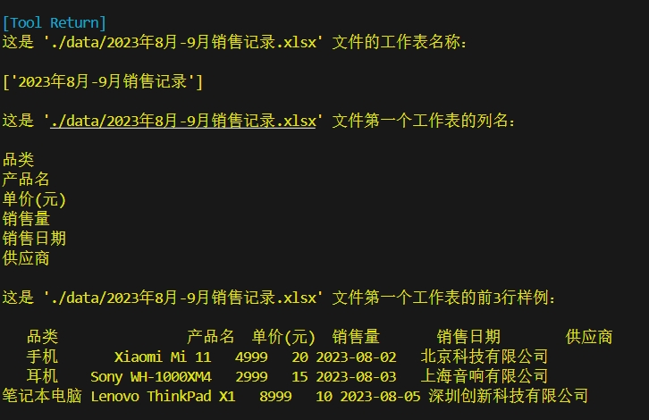
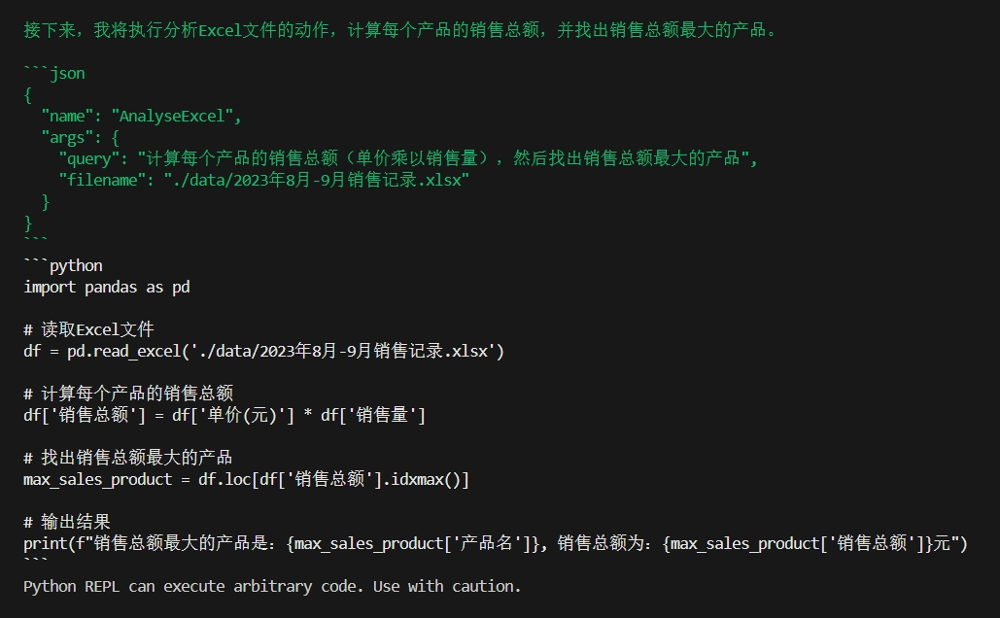

# GPT 自动化多模态任务项目
**Language:** [](/README.md)

本项目展示了如何利用 GPT 自动化检索仓库内的文件（如 PDF、XLS、Word 等）并完成多模态任务。可将家庭摄像头的视频帧送入仓库，可以自动化判断家庭是否危险的事情（利用大模型对世界的理解力）。

## 简单的运行展示
### 使用示例

运行 `main.py` 后，在命令窗口中对话，agent 可以自行拆解关键概念如“销售额不达标”等，并思考可以执行的操作（如调用工具），这些操作基于 chain of thought 技术，具体的思维树main提示词可见`prompts\main\main.txt`。输出的自然语言代表具象的思维，人类大脑里的思维还要再复杂一些有时候可以称为抽象的字符，agent的思维是纯自然语言。

### 多轮对话任务完成示例
使用`ListDirectory`工具，如图可正确输出json格式调用工具列出仓库所有文件，并以此展开下一轮思考。

如执行工具“AskDocument”提问以调取另一个大模型来获取想要知道的文档内容。


### 当前工具列表

agent作为主要的调度者，可以调用多个AI来执行写邮件发送邮件，问询文档内容等等，其中问询另一个AI想要知道的文档中的内容或者结论，此种方法比RAG更适合autoagent场合。
- **openimage**: 用于打开仓库的图像以加入对话，赋予agent查询图像的能力。
- **ExcelTool**: 可以获取Excel表格的所有列以及前三行，送入agent让agent判断表格内容是否是想要的。

- **PythonTool**: 定义了一个AI接受agent的query(包含需要分析的Excel文件路径)，AI可以编写code并运行来计算加总表格内的一些变量来分析表格。


考虑到 agent 作为调度者，不占用 main_prompt 的 token，节省 token 并避免因为中间夹杂多任务而忘记最终目的是完成用户的query。


### 未来计划
- 增加UI以至可以聊天窗口输入图像
- 以及增加解析word或者网页图文格式。

## 环境配置

### 第一步：设置 .env
将项目中的 `.env` 文件中的 `OPENAI_API_KEY` 配置为自己的 API 密钥。
```
OPENAI_API_KEY=sk-xxxx
```
需要在 [此处](https://devcto.com/) 购买 API 密钥。

### 第二步：设置本地库
执行下面命令：
```
export HNSWLIB_NO_NATIVE=1
```
### 第三步：安装依赖包

执行下面命令：
```
pip install -r requirements.txt
```

### 第四步：运行

##### 运行 main.py 文件

##### 然后在界面里面输入问题：
🤖：有什么可以帮您？
👨：9月份的销售额是多少（需要自己输入）
>>>>Round: 0<<<<

##### 问题参考：
* 9月份的销售额是多少
* 销售总额最大的产品是什么
* 帮我找出销售额不达标的供应商
* 给这两家供应商发一封邮件通知此事
* 对比8月和9月销售情况，写一份报告
* 总结仓库图像内容

此为多模态的基础版本，因langchain版本更新，因此还需后续更新。
